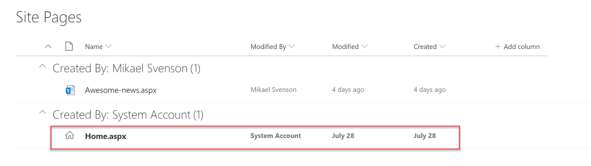

# Hightlight Home Page by Puzzlepart

Field customizer which will highlight the home page for a site in *Site Pages*.




## Installing the solution

- Upload the file [pzl-ext-highlight-home.sppkg](./pzl-ext-highlight-home.sppkg) to either your tenant app catalog or to a site app catalog.
- Add the application named *Hightlight Home Page by Puzzlepart* to your site, and wait for install to finish.
- Make sure your user is a site administrator or owner the first time you test it to ensure proper installation.
- Navigate to the `Site Pages` library, and you should see the current home page being high lighted in the list of all pages in the site.

## Troubleshooting
If you don't see the page highlighted right away, refresh your page. Also make sure you access the site as a site administrator or owner in order for the field customizer to be installed.

## Technical details
The solution adds a field customizer to the field `DocIcon`, and replace the default icon with an icon for Home. The row is also bolded. It's not possible to modify this field using `elements.xml` directly, so the application also includes a run-once application customizer which will install the field customizer, and then remove itself.

## Building the code

```bash
git clone the repo
npm i
npm i -g gulp
gulp
```