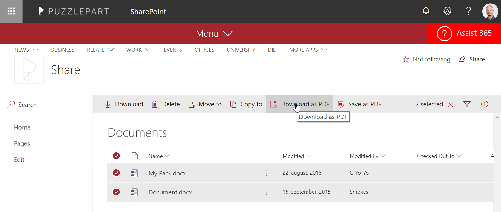
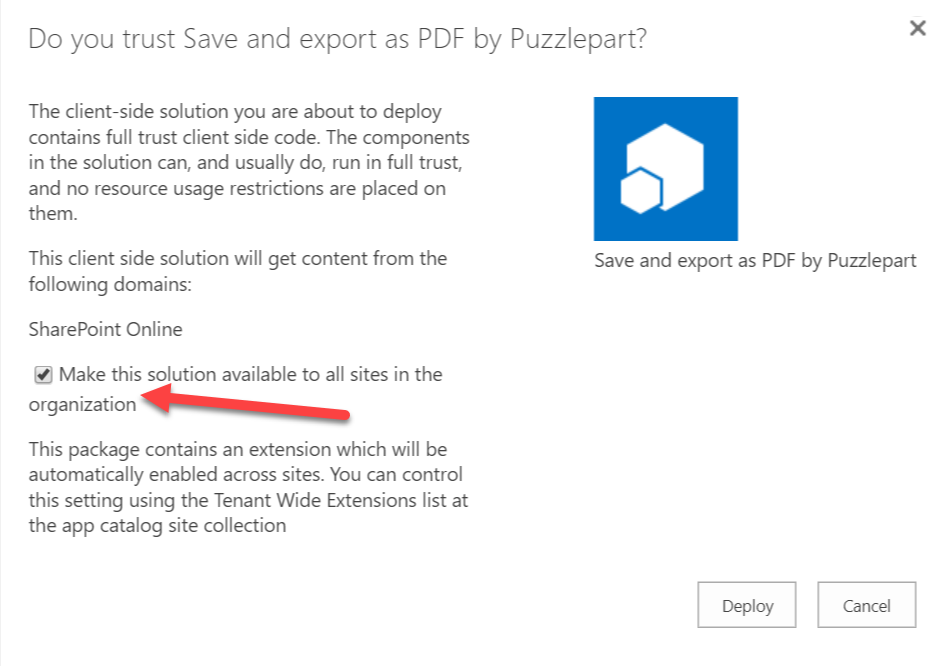

# Save and export as PDF by Puzzlepart

A global list customizer which adds functionality to all document libraries in SharePoint Online to convert one or more documents in-place to PDF, or download one or more documents as a PDF. When selecting multiple documents for download they will be downloaded as a zip file.



## Installing the solution

- Upload and Deploy the file [pzl-ext-highlight-home.sppkg](./pzl-ext-pdf-export.sppkg) to your tenant app catalog. 
    * If created the tenant app catalog can be reached via `https://<tenant>-admin.sharepoint.com/_layouts/15/online/ManageAppCatalog.aspx`.
    * You need to be a SharePoint Administrator to upload this solution.
- Navigate to a document library and select one or more files and you should see the PDF options in the document ribbon.

_Note: It may take a little while before it shows the first time after install._

## Supported file formats
csv, doc, docx, odp, ods, odt, pot, potm, potx, pps, ppsx, ppsxm, ppt, pptm, pptx, rtf, xls, xlsx

### Building the code

Ensure that at least SPFx v1.6 is installed.

```bash
git clone https://github.com/Puzzlepart/spfx-solutions.git
cd spfx-solutions/Pzl.Ext.PDFExport
npm i
gulp
```

This package produces the following:

* lib/* - intermediate-stage commonjs build artifacts
* dist/* - the bundled script, along with other resources
* deploy/* - all resources which should be uploaded to a CDN.
