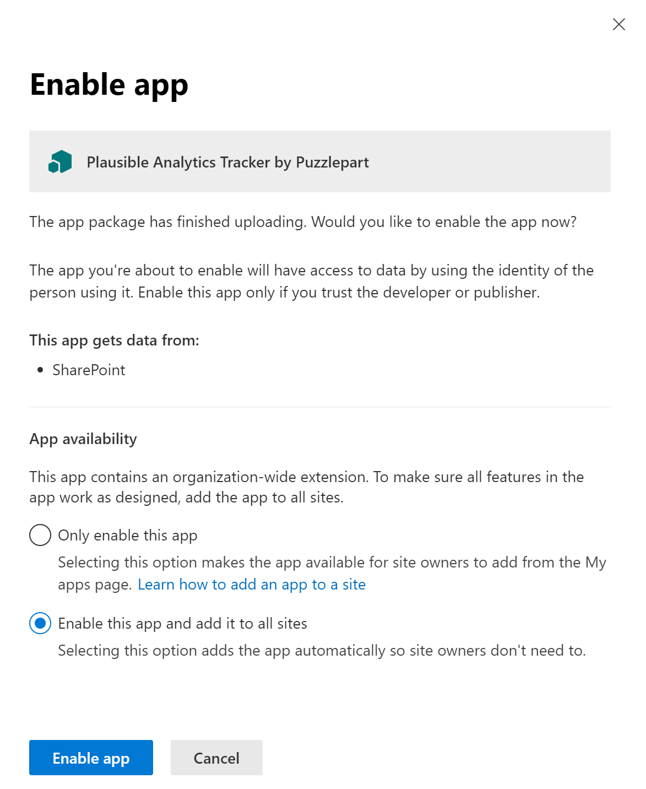
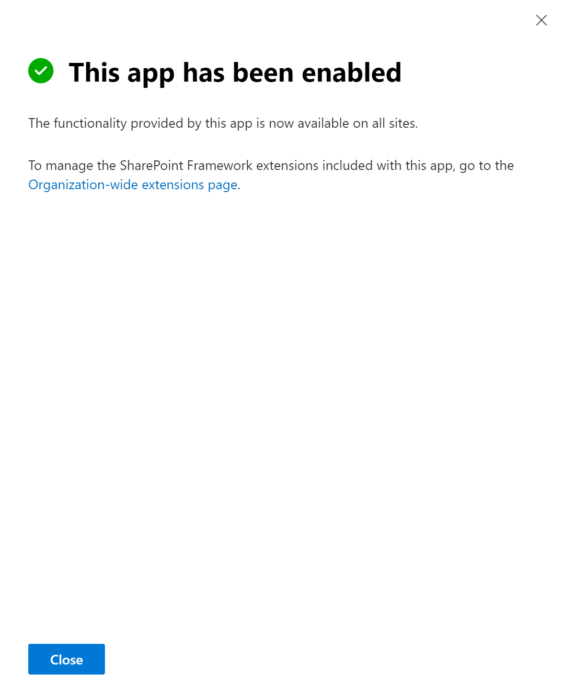

# Plausible Analytics Tracker

## Summary

Application Customizer for tracking modern SharePoint page views to https://plausible.io/

> Plausible is lightweight and open source web analytics. No cookies and fully compliant with GDPR, CCPA and PECR. Made and hosted in the EU, powered by European-owned cloud infrastructure

Choose the scope of your analytics tracking:

1. Track page views across all sites in the tenant
1. Track page views across all sites in a hub
1. Track page views for specific sites

## Configuration options
### Limit page tracking to a SharePoint Hub and all associated sites
* Specify the id of the hub site using the `hubSiteId` (component) property
  * Open https://TENANT.sharepoint.com/sites/SITE/_api/site/id/_api/site/id to find the ID
  * Either update 'Properties' in `sharepoint/assets/ClientSideInstances.xml` before build
  * or update 'Component Properties' in `Tenant Wide Extensions` after deployment

### Limit page tracking to specific sites
* Update `config/package-solution-json` before build
  * Set `"skipFeatureDeployment": false`
  * Remove `ClientSideInstance.xml` from `elementManifests`
### Send page tracking to a self-hosted Plausible installation (Docker)
* Specify the hostname of your Plausible instance using the `apiHost` (component) property
  * Either update `Properties` in `sharepoint/assets/ClientSideInstances.xml` before build
  * or update `Component Properties` in `Tenant Wide Extensions` after deployment
  * or specify `ClientSideComponentProperties` during site specific installation using the `Add-PnPCustomAction` PowerShell command
## Used SharePoint Framework Version


## Clone the repo

```bash
git clone https://github.com/Puzzlepart/spfx-solutions.git
```
## Build the solution

```bash
npm i
gulp bundle --ship
gulp package-solution --ship
```

## Deploy the solution

### Option #1 - Install for all sites in the tenant

1. Upload `sharepoint/solution/pzl-ext-plausible-analytics.sppkg` to the global app catalog, e.g. https://TENANT.sharepoint.com/sites/appCatalog/_layouts/15/tenantAppCatalog.aspx/manageApps
1. Select `Enable this app and add it to all sites` 
1. Click `Enable app`
1. Click `Close`
1. Login to https://plausible.io/TENANT.sharepoint.com and enjoy your stats 



### Option #2 - Install for all sites in a hub

1. Upload `sharepoint/solution/pzl-ext-plausible-analytics.sppkg` to the global app catalog, e.g. https://TENANT.sharepoint.com/sites/appCatalog/_layouts/15/tenantAppCatalog.aspx/manageApps
1. Select `Enable this app and add it to all sites` 
1. Click `Enable app`
1. Click `Organization-wide extensions page` to open the `Tenant Wide Extensions` list in the global app catalog, e.g. https://TENANT.sharepoint.com/sites/appCatalog/Lists/TenantWideExtensions
1. Locate **Plausibe Analytics Tracker** in the list
1. Specify the `hubSiteId` value. This is the site id (Guid) of your Hub site 
1. Login to https://plausible.io/TENANT.sharepoint.com and enjoy your stats 



### Option #3 - Install for a specific site

1. Upload `sharepoint/solution/pzl-ext-plausible-analytics.sppkg` to the site specific app catalog, e.g. https://TENANT.sharepoint.com/sites/SITE/AppCatalog
Run the following PowerShell commands (requires changes in config/package-solution.json). Update trackerID below.
1. `Connect-PnPOnline https://TENANT.sharepoint.com/sites/SITE -Interactive`
1. `Add-PnPCustomAction -ClientSideComponentId "d98b227b-1bc5-4a9a-9b84-601f75d2f8ca" -Name "PlausibleAnalyticsTracker" -Title "Plausible Analytics Tracker by Puzzlepart" -Location ClientSideExtension.ApplicationCustomizer -ClientSideComponentProperties: '{"hubSiteId":"HUB-SITE-ID"}' -Scope site`


## Dependencies

- https://github.com/plausible/plausible-tracker
