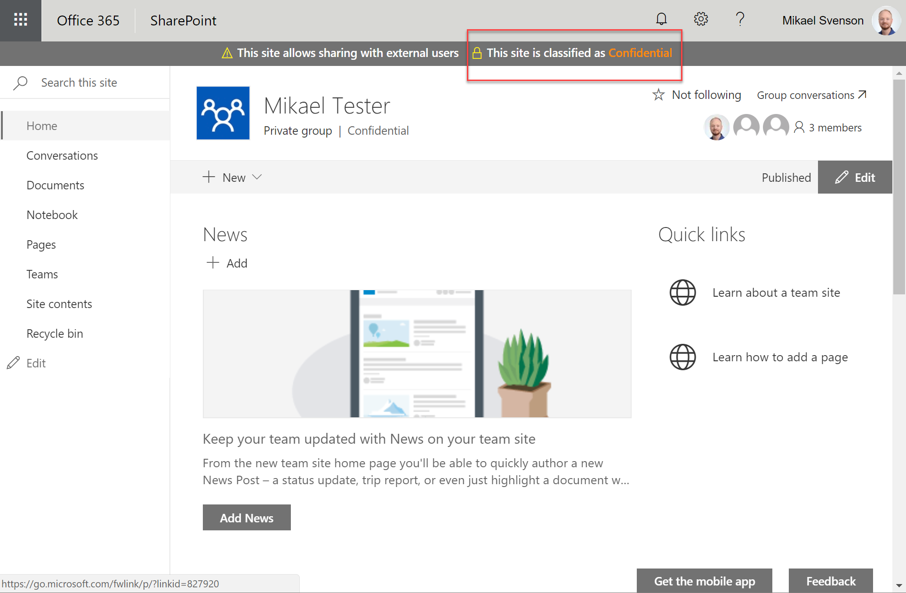

## Classification Notification by Puzzlepart



Extension which will show a message if the classification level of the site is a level specified to be highlighted.

The extension takes a parameter `messageId` which should be a unique ID, and should match the ID used with `pzl-ext-status.sppkg`. It also takes a parameter `classifications` which is a comma separated list of classification values to be highlighted.

Requires:

* [Modern Site Status Renderer by Puzzlepart](../Pzl.Ext.StatusBar/README.md)

### Add to a site using the following PnP template

The [template](./template.xml) takes the following PnP input setting as a string value `messageId`.

```xml
<?xml version="1.0"?>
<pnp:Provisioning 
    xmlns:pnp="http://schemas.dev.office.com/PnP/2018/01/ProvisioningSchema">
    <pnp:Preferences Generator="OfficeDevPnP.Core, Version=2.19.1710.0, Culture=neutral, PublicKeyToken=null" />
    <pnp:Templates ID="CONTAINER-TEMPLATE-CLASSIFICATION-NOTIFICATION">
        <pnp:ProvisioningTemplate ID="TEMPLATE-CLASSIFICATION-NOTIFICATION" Version="1" BaseSiteTemplate="GROUP#0" Scope="RootSite">
            <pnp:CustomActions>
                <pnp:SiteCustomActions>
                    <pnp:CustomAction
                        Title="ClassificationNotificationApplicationCus"
                        Name="ClassificationNotificationApplicationCus"
                        Location="ClientSideExtension.ApplicationCustomizer"
                        ClientSideComponentId="65d69098-686c-44e7-9ac3-626f788d21fd"
                        ClientSideComponentProperties="{&quot;messageId&quot;:&quot;{parameter:MessageId}&quot;,&quot;classifications&quot;:&quot;{parameter:Classifications}&quot;}" />
                </pnp:SiteCustomActions>
            </pnp:CustomActions>
        </pnp:ProvisioningTemplate>
    </pnp:Templates>
</pnp:Provisioning>
```

Sample command using PnP PowerShell
```powershell
Apply-PnPProvisioningTemplate -Path template.xml -Parameters @{"MessageId"="PzlMsg","Classifications"="Confidential,Highly Confidential"}
```

### Building the package

```bash
git clone the repo
npm i
gulp --ship
gulp package-solution --ship
```

This package produces the following:

* sharepoint/solution/pzl-ext-classification.sppkg - package to install in the App Catalog
