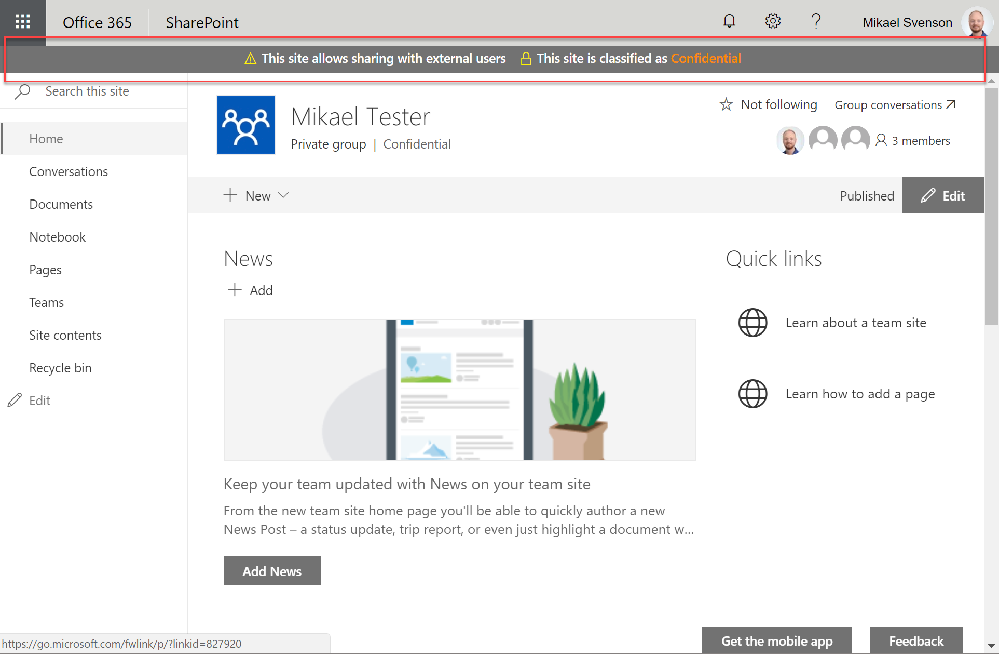

## Modern Site Status Renderer by Puzzlepart



Extension which will render messages produced by other extensions adding markup to the same messageId as this extension listens to.
The extension takes a parameter `messageId` which should be a unique ID.
up owners, which is a requirement.

Can be used in conjunction with:

* [External Access Disclaimer Status by Puzzlepart](../Pzl.Ext.StatusBar.GroupExternalDisclaimer/README.md)
* [Classification Notification by Puzzlepart by Puzzlepart](../Pzl.Ext.StatusBar.Classification/README.md)

### Add to a site using the following PnP template

The [template](./template.xml) takes the following PnP input setting as a string value `messageId`.

```
<?xml version="1.0"?>
<pnp:Provisioning 
    xmlns:pnp="http://schemas.dev.office.com/PnP/2018/01/ProvisioningSchema">
    <pnp:Preferences Generator="OfficeDevPnP.Core, Version=2.19.1710.0, Culture=neutral, PublicKeyToken=null" />
    <pnp:Templates ID="CONTAINER-TEMPLATE-GROUPS-STATUS">
        <pnp:ProvisioningTemplate ID="TEMPLATE-GROUPS-STATUS" Version="1" BaseSiteTemplate="GROUP#0" Scope="RootSite">
            <pnp:CustomActions>
                <pnp:SiteCustomActions>
                    <pnp:CustomAction
                        Title="ModernSiteStatusbarApplicationCustom"
                        Name="ModernSiteStatusbarApplicationCustom"
                        Location="ClientSideExtension.ApplicationCustomizer"
                        ClientSideComponentId="197aca47-f10e-4955-95df-202d2dafaea7"
                        ClientSideComponentProperties="{&quot;messageId&quot;:&quot;{parameter:MessageId}&quot;}" />
                </pnp:SiteCustomActions>
            </pnp:CustomActions>
        </pnp:ProvisioningTemplate>
    </pnp:Templates>
</pnp:Provisioning>
```

Sample command using PnP PowerShell
```
Apply-PnPProvisioningTemplate -Path template.xml -Parameters @{"MessageId"="PzlMsg"}
```

### Building the package

```bash
git clone the repo
npm i
gulp --ship
gulp package-solution --ship
```

This package produces the following:

* sharepoint/solution/pzl-ext-status.sppkg - package to install in the App Catalog
