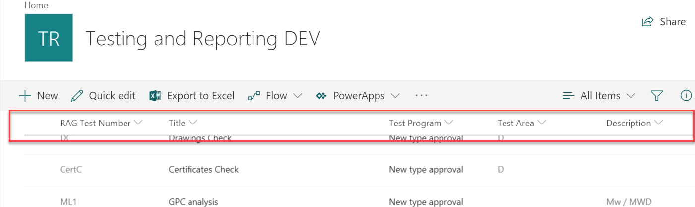

# Sticky List Header by Puzzlepart

This is an extension which performs DOM manipulation to ensure the header of lists and libraries are sticky, and does not scroll out of view when you have many items in the list. This solutions is merely a band-aid until this User Voice request gets enough votes (please up-vote): https://sharepoint.uservoice.com/forums/329214-sites-and-collaboration/suggestions/16077640-freeze-column-headers



## Code details
The code is build as a `ListViewCommandSet`, but it does not contain any buttons or actions. The logic is places in the `onInit` method where the header row is located and modified with CSS to ensure it stays visible when scrolling.


## Deploying the solution

The code as is is built as a globally available package named `pzl-ext-sticky-list-header.sppkg`. To enable it on a site collection (until globally deployed extensions are available in SPFx1.6?), you register the custom action where you want the stickiness applied :) The below template/command will register it on all lists and libraries.

## PnP PowerShell Command to apply sticky header
```ps
Connect-PnPOnline -Url https://contoso.sharepoint.com/sites/stickiness
Add-PnPCustomAction -Title "StickyHeader" -Name "StickyHeader" -Scope Site -Location "ClientSideExtension.ListViewCommandSet" -ClientSideComponentId "18603209-c031-4905-b62f-8fff7cd00e83" -RegistrationType List
```

## PnP Template for applying sticky header

Save the below template as `sticky-header-pnp-template.xml`.

```xml
<?xml version="1.0"?>
<pnp:Provisioning xmlns:pnp="http://schemas.dev.office.com/PnP/2017/05/ProvisioningSchema">
    <pnp:Preferences Generator="OfficeDevPnP.Core, Version=2.19.1710.0, Culture=neutral, PublicKeyToken=null" />
    <pnp:Templates ID="CONTAINER-TEMPLATE-PZL-STICKY-HEADER">
        <pnp:ProvisioningTemplate ID="TEMPLATE-PZL-STICKY-HEADER" Version="1" BaseSiteTemplate="GROUP#0" Scope="RootSite">
            <pnp:CustomActions>
                <pnp:SiteCustomActions>
                    <pnp:CustomAction Title="StickyHeader" Name="StickyHeader" Sequence="1" RegistrationId="" RegistrationType="List" Location="ClientSideExtension.ListViewCommandSet" ClientSideComponentId="18603209-c031-4905-b62f-8fff7cd00e83" ClientSideComponentProperties="" />
                </pnp:SiteCustomActions>
            </pnp:CustomActions>
        </pnp:ProvisioningTemplate>
    </pnp:Templates>
</pnp:Provisioning>
```

```ps
Connect-PnPOnline -Url https://contoso.sharepoint.com/sites/stickiness
Apply-PnPProvisioningTemplate -Path .\sticky-header-pnp-template.xml
```

