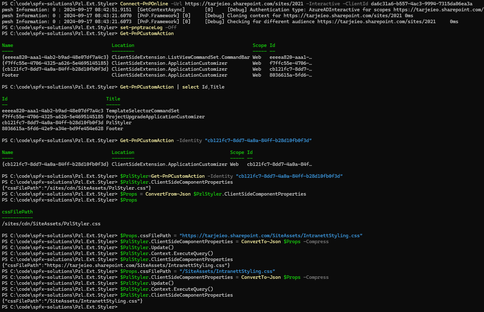

# pzl-ext-styler

## Summary

This Application customizer lets you override any and all CSS on SharePoint pages across the site collection. Place your CSS file named `PzlStyler.css` in SiteAssets placed under /sites/cdn/. The path can also be configured, see further down on this page for examples.

Add the Pzl.Ext.Styler app to your SharePoint sites to enjoy the style of the day for the sites you choose to add it to.

## Used SharePoint Framework Version


## Applies to

- [SharePoint Framework](https://aka.ms/spfx)
- [Microsoft 365 tenant](https://docs.microsoft.com/en-us/sharepoint/dev/spfx/set-up-your-developer-tenant)

## Prerequisites

SharePoint Administrator for app catalog deployment.
We recommend that site owners add the extention manually per site.

## Solution

| Solution       | Author(s)                                               |
| -------------- | ------------------------------------------------------- |
| Pzl.Ext.Styler | Pål Olav Loftesnes (www.paalolav.no)                    |

## Version history

| Version | Date             | Comments        |
| ------- | ---------------- | --------------- |
| 1.1     | September 17, 2024 | Flexible CSS path |
| 1.0     | August 24, 2023 | Initial release |

## Disclaimer

**THIS CODE IS PROVIDED _AS IS_ WITHOUT WARRANTY OF ANY KIND, EITHER EXPRESS OR IMPLIED, INCLUDING ANY IMPLIED WARRANTIES OF FITNESS FOR A PARTICULAR PURPOSE, MERCHANTABILITY, OR NON-INFRINGEMENT.**

---

## Minimal Path to Awesome

- Clone this repository
- Ensure that you are at the solution folder
- in the command-line run:

```bash
npm install
```

```bash
gulp bundle --ship
gulp package-solution --ship
```

# Watching the code 
```bash
gulp serve
```

## Features

Extension that enables you to add CSS styling to any SharePoint site.
Using the sample file, we remove the site header for all news stories in the OOTB News web part.

Before Pzl.Ext.Styler is installed:

[](images/Styler%20off.png)

After Pzl.Ext.Styler is installed:

[](images/Styler%20on.png)

Here we've added border radius to the weather web part and changed colours and border radius on the Quick Links web part:

[](images/Weather%20and%20quicklinks.png)

## Configuration

The path to the CSS file can be configured per site, making it possible to load different CSS files for different sites. The file is loaded as a ClientSideComponentProperty of the PzlStyler Custom Action.

See example configuration:

[](images/PowerShell_Example_Usage.png)