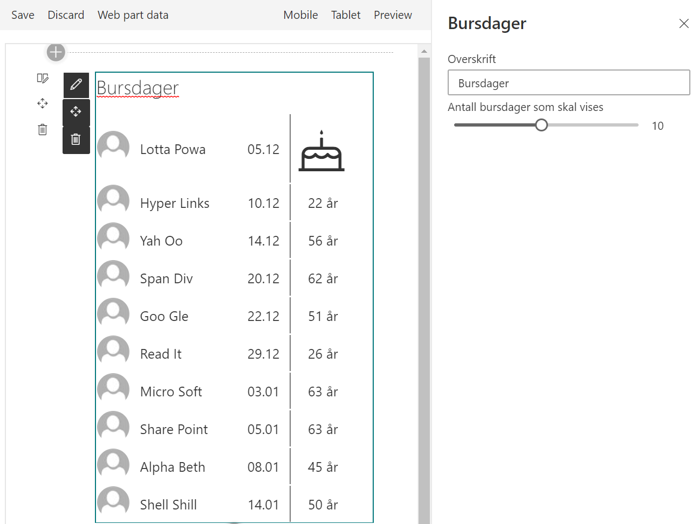

# Birthday calendar by Puzzlepart

If you need a birthday web part to display upcomming birthdays, this is what you are looking for. You have option to set web part header and the number of persons to list.



## Prerequisites

The web part is a search (Local People results) query for fetching data, loading the properties for `WorkEmail`, `PreferredName`, `Department` and  `JobTitle`.

For the web part to work properly you must map the crawled value for `SPS-Birthday` to a managed property `RefinableDateXX` and set the alias for the managed property to `Birthday`. You may use any *RefinableDate*, for exampel `RefinableDate00`. This can be set in the Search Schema settings.

> **IMPORTANT**
> Set the _Alias_ in the `RefinableDate00` (in the used RefinableDateXX) property to `Birthday`.
>
> **OPTIONAL**
> By adding a year of birth property to the user profile you can  get the age display for every person in the web part.
> In the search schema settings map the crawled value for your year of birth to a managed property of type `RefinableStringXX` and set the alias to `Birthyear`.

## Building the code

```bash
git clone the repo
npm i
gulp bundle --ship
gulp package-solution --ship
```

**This package produces the following:**

sharepoint/solution/pzl-part-birthday.sppkg - package to install in the App Catalog
