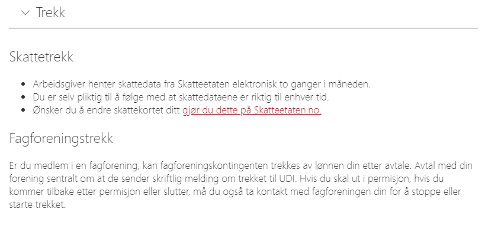
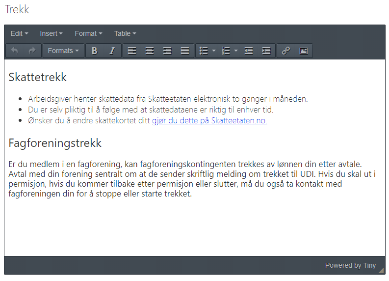
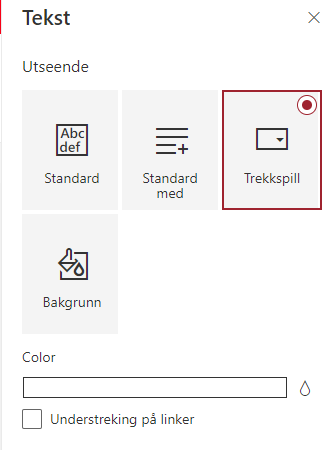

## Custom-text-editor

Simple web part with enhanced text editor to add text to page. Includes a most-wanted accordion mode to present your content like a professional.

### Render mode



### Edit mode



### Web part settings



### Building the code

```bash
git clone the repo
npm i
npm i -g gulp
gulp
```

This package produces the following:

* lib/* - intermediate-stage commonjs build artifacts
* dist/* - the bundled script, along with other resources
* deploy/* - all resources which should be uploaded to a CDN.


### Build the code for production

```bash
npm i
gulp bundle --ship
gulp package-solution --ship
```

Bring the file sharepoint/solution/pzl-custom-text-editor.sppkg to an app catalog, add the app and have fun :)