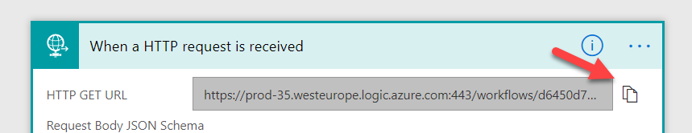
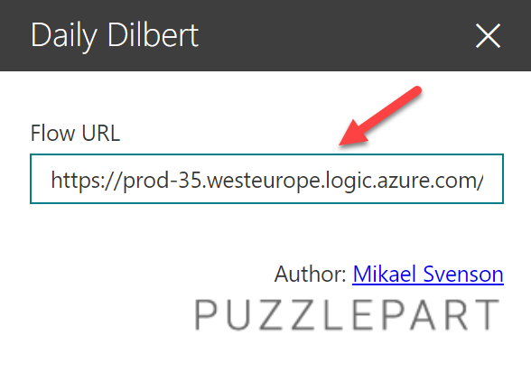

## Daily Dilbert Modern Web Part

This web part will together with Microsoft Flow fetch and show the daily dilbert cartoon.

### Building the code

```bash
git clone https://github.com/Puzzlepart/spfx-solutions.git
npm i
gulp --ship
gulp package-solution --ship
```

### Installing
* Copy `pzl-part-dilbert.sppkg` from `sharepoint\solution` and install it in your tenant.
* Import `DailyDilbert_Flow.zip` to your Microsoft Flow environment
* Open the flow after import and copy the URL of the request URL.
  <br/>
* Paste the copied URL into the web part settings
  <br/>
* Save and enjoy!

### Other references
* http://comicfeeds.chrisbenard.net/view/dilbert/default


