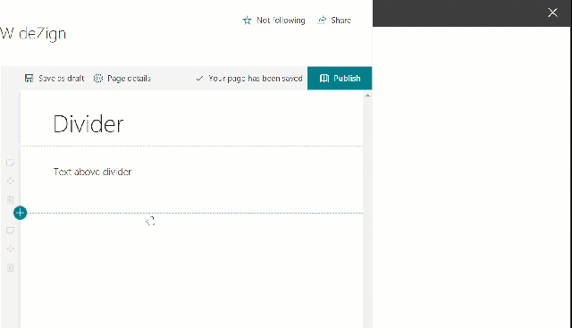

## Divider by Puzzlepart

If you need a more flexible page divider, this is what you are looking for. You have the option to set both width and color.




## Replacing the out of the box divider web part with this one
(This feature is not yet enabled in SPO)
Using PnP PowerShell and the object model you can disable certain web parts from showing in the toolbox for your tenant.

```powershell
Connect-PnPOnline https://<tenant>-admin.sharepoint.com
$ctx = Get-PnPContext
$tenant = New-Object -TypeName "Microsoft.Online.SharePoint.TenantAdministration.Tenant" -ArgumentList $ctx
# Get existing list of blocked web parts
$ids = @($tenant.DisabledWebPartIds)
# Add the id for the out of the box Divider web part
$ids += [Guid]'2161a1c6-db61-4731-b97c-3cdb303f7cbb'
$ids = $ids | Where-Object {$_}
$tenant.DisabledWebPartIds = $ids
$tenant.Update()
Invoke-PnPQuery
```

### Building the package

```bash
git clone the repo
npm i
gulp --ship
gulp package-solution --ship
```

This package produces the following:

* sharepoint/solution/pzl-part-divider.sppkg - package to install in the App Catalog
