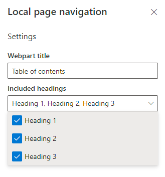
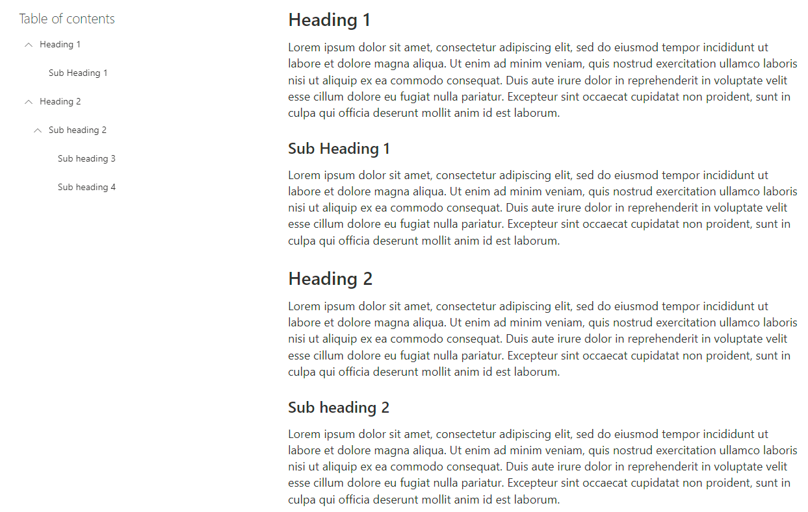
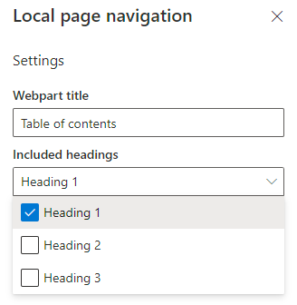
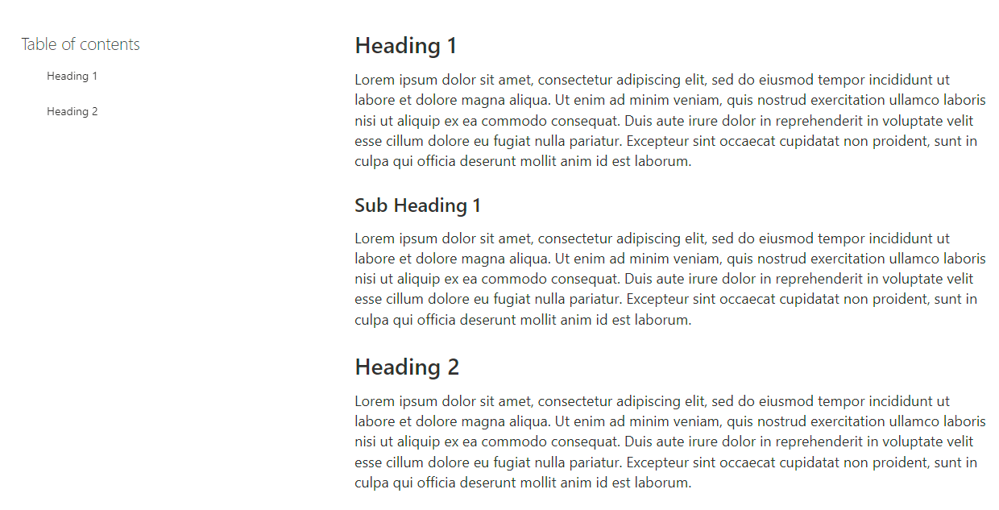

# Local page navigation

## Summary

This web part provides a local navigation menu for a Sharepoint site page, dynamically generated from headings in text web parts on the page. It has a configurable title and generates links to the heading styles specified in the web part settings. Available headings include heading 1, heading 2, and heading 3. These settings are preconfigured with the title "Table of contents", and all three heading styles, and can be changed in the web part settings.

If multiple heading styles are selected, and the page has headings in different styles in order, the hierarchy of headings is preserved, and links in the menu are grouped together with their respective children. These links are collapsible and are all expanded by default on page load.

If only one heading style is selected, or only one heading style is used on the page, there will be no grouping, and links are generated in the order they appear on the page.

Clicking a link in the menu will send the user to the corresponding heading on the page.

# Development

## Used SharePoint Framework Version

## Applies to

- [SharePoint Framework](https://aka.ms/spfx)
- [Microsoft 365 tenant](https://docs.microsoft.com/en-us/sharepoint/dev/spfx/set-up-your-developer-tenant)

> Get your own free development tenant by subscribing to [Microsoft 365 developer program](http://aka.ms/o365devprogram)

## Prerequisites

> Node v14.15.0
>
> npm

## Minimal Path to Awesome

- Clone this repository

- Ensure that you are at the solution folder

- in the command-line run:
  - **npm install**
  - **gulp serve**
  
  

------

## Disclaimer

**THIS CODE IS PROVIDED *AS IS* WITHOUT WARRANTY OF ANY KIND, EITHER EXPRESS OR IMPLIED, INCLUDING ANY IMPLIED WARRANTIES OF FITNESS FOR A PARTICULAR PURPOSE, MERCHANTABILITY, OR NON-INFRINGEMENT.**