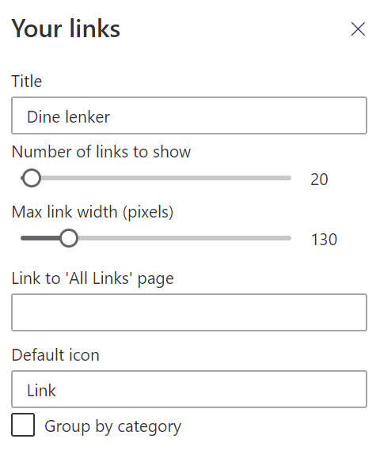
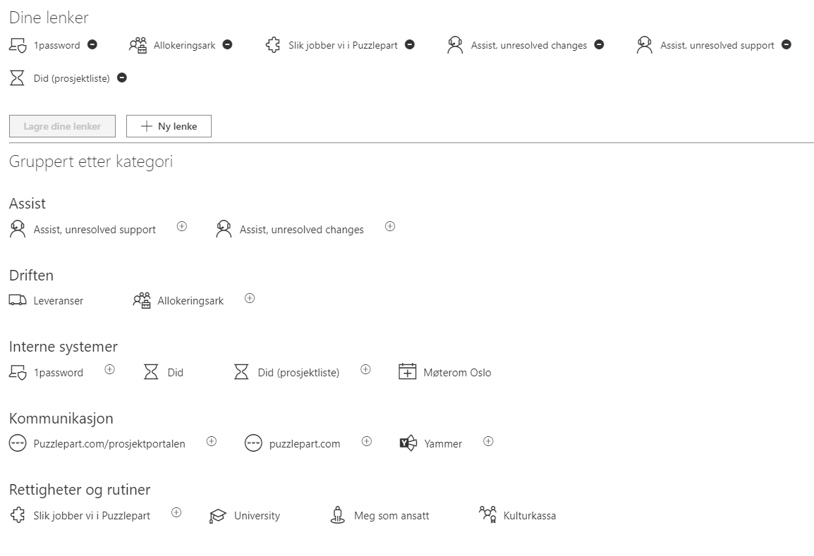
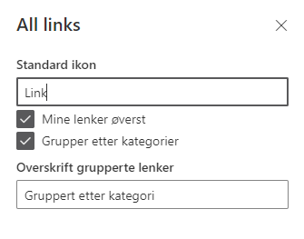

# Quick Links by Puzzlepart

Solution consists of two web parts and two lists.

## Web parts

### Quick links web part

used typically on the front page to see mandatory and user-selected links. Supports adding a webhook which will be called when a link is clicked. The json payload contains the link url and the link category:

```json
{
  "url": "https://www.puzzlepart.com",
  "category": "Mandatory"
}
```

Under /Templates you will find a sample webhook implementation in Azure Functions.




### All links web part - used for seeing all links and adding personal links




## Lists

* EditorLinks
  * Entries for links. You can add both mandatory and optional links.
  * Icons can be names from Office UI Fabric - [https://developer.microsoft.com/en-us/fabric#/styles/icons](https://developer.microsoft.com/en-us/fabric#/styles/icons)
* FavouriteLinks
  * It's important that all employees have write access to this list
  * Configure in advanced settings that users can only see and edit their own items
  * The list stores one entry per user

## Installation

### Create the needed lists on the site where you want to host the quick links solutions

Clone the project or download all artefacts. The template QuickLinks.xml is located in the templates-folder. Use PnP.PowerShell to install, see example:

```powershell
Connect-PnPOnline -Url "https://tenantnamehere.sharepoint.com/sites/intranet" -Interactive
Invoke-PnPSiteTemplate -Path ".\templates\QuickLinks.xml"
```

### Upload the web part package to a site collection app catalog

This can be done manually by navigating to the app catalog and uploading the sppkg package from the build.

### Pages

* Create a page for the *All links* web part, and add the*ALl links* web part
* Add the *Your links* web page to the frontpage, and set the URL for all links in the web part properties to point to the *all links* page

## Building

### Building the code

```bash
git clone the repo
npm i
npm i -g gulp
gulp bundle
```

### Testing
You can test by using the workbench
`gulp serve`


```
https://<tenant>.sharepoint.com/sites/<site>/_layouts/15/workbench.aspx?debug=true&noredir=true&debugManifestsFile=https://localhost:4321/temp/manifests.js
```

### Building the code for production

```bash
gulp bundle --ship
gulp package-solution --ship
```
