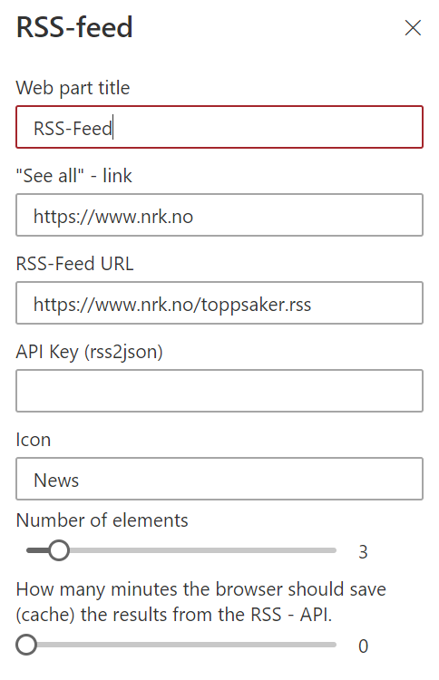

# RSS-feed by Puzzlepart

Customizable RSS-feed web part.




## Building the code

```bash
git clone the repo
npm i
npm i -g gulp
gulp
```
## Packaging the code for install

```bash
git clone the repo
npm i
npm i -g gulp
gulp bundle --ship
gulp package-solution --ship
```
